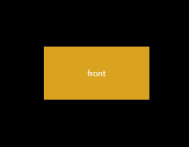
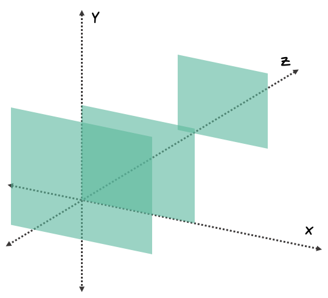

# 3d_Button


## 효과 
마우스를 버튼위에 올리면 버튼이 회전

## 학습
### 1. CSS : transform-style: preserve-3d
 중첩된 요소가 3D 공간에서 렌더링되는 방식을 지정

속성값|의미
---|---|
flat|자식요소가 3D 위치 유지 X. (기본값)
preserve-3d|자식요소가 3D 위치 유지 O.
initial|이 속성의 기본값으로 설정.
inherit|부모요소의 속성값 상속.

## 2. CSS : transform: translate   
   

우리가 보는 웹 페이지는 기본적이로 2d이지만 원근법을 바탕으로 3d의 효과를 줄 수 있다.

아래처럼 3차원의 기본 개념을 바탕으로 translate를 통해 좌표를 이동한다고 생각하면 된다. 

속성값|의미|
---|---|
translate(x, y) | 기본적으로 설정 된 현재 위치로 부터 x, y축으로 특정 거리만큼 이동, translateX, translateY를 함께 사용한 것과 동일한 효과
translateX(x) | 기본적으로 설정 된 현재의 위치로 부터 x축으로 특정 거리만큼 이동  
translateY(y) | 기본적으로 설정 된 현재의 위치로 부터 y축으로 특정 거리만큼 이동  
translate3d(x, y, z) | 기본적으로 설정 된 현재의 위치로 부터 x, y, z축으로 특정 거리만큼 이동, translateX, translateY, translateZ를 함께 사용한 것과 동일한 효과이나 2d와는 달리 이를 감싸고 있는 요소에 perspective를 통해 원근값을 설정해주어야 한다.
translateZ(z) | 기본적으로 설정 된 현재의 위치로 부터 z축으로 특정 거리만큼 이동한다. translate3d와 동일하게 perspective를 통해 원근값을 설정해주어야 한다.

```
// translate(x, y)
.element {
    transform: translate(50px, 30px);
}

// translateX(x) 
.element {
    transform: translateX(50px);
}

// translateY(y)
.element {
    transform: translateY(30px);
}

// translate3d(x, y, z)
.element-wrapper {
    perspective: 500px; // 관찰자가 500px 떨어진 위치에서 관찰하고 있다는 의미
}

.element {
    transform: translate3d(50px, 30px, -40px);
}  

// translateZ(z)
.element-wrapper {
    perspective: 500px; // 관찰자가 500px 떨어진 위치에서 관찰하고 있다는 의미
}

.element {
    transform: translateZ(-40px);
}
```

## 학습 출처 
**유튜브**    
https://www.youtube.com/@sucoding    

**CSS**    
https://www.w3schools.com/cssref/css3_pr_transform-style.php     
https://happy-playboy.tistory.com/entry/CSS-Transform-%EC%95%8C%EC%95%84%EB%B3%B4%EA%B8%B02-translate    

